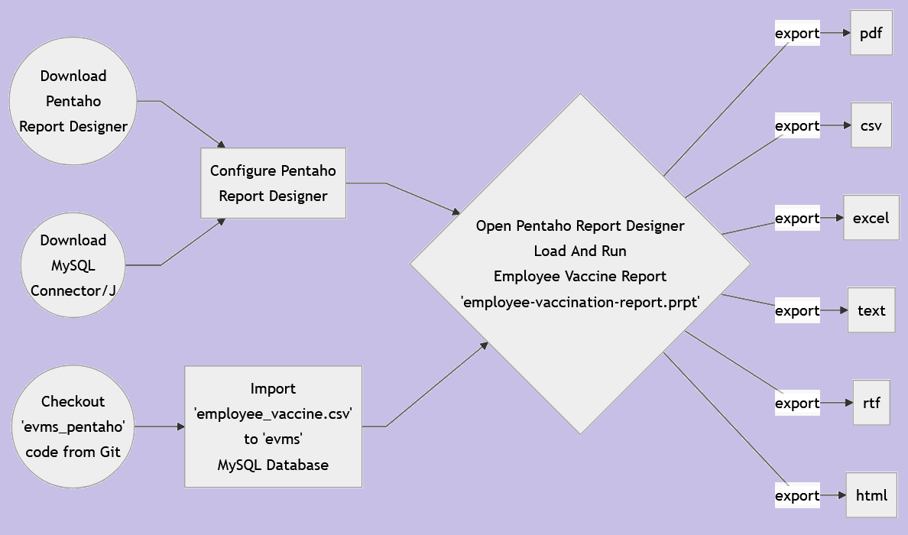
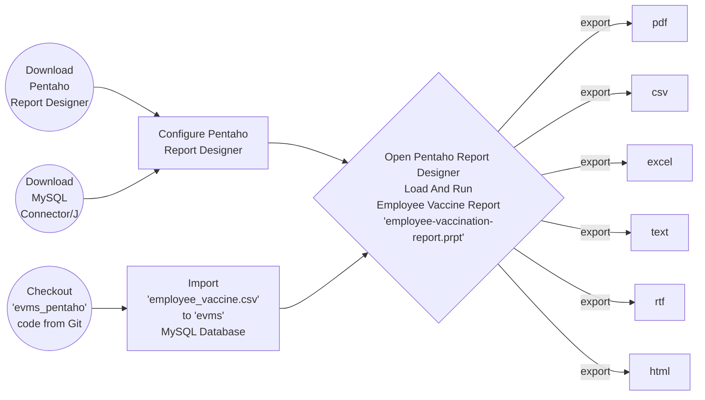

# Step by Step Guide to Create Employee Vaccination Report using Open Source Pentaho Report Designer

### Workflow

### References
<ul>
 <li><a href="https://jdk.java.net/17/">Open JDK 17</a></li>
 <li><a href="https://sourceforge.net/projects/pentaho/files/Pentaho-9.3/client-tools/prd-ce-9.3.0.0-428.zip/download">Open Source Pentaho Report Designer (Free)</a></li>
 <li><a href="https://mvnrepository.com/artifact/mysql/mysql-connector-java/8.0.30">MySQL J Connector</a></li>
 <li><a href="https://evmsall.herokuapp.com">Fully Functional Employee Vaccination Management System</a></li>
</ul>

### Tutorial

